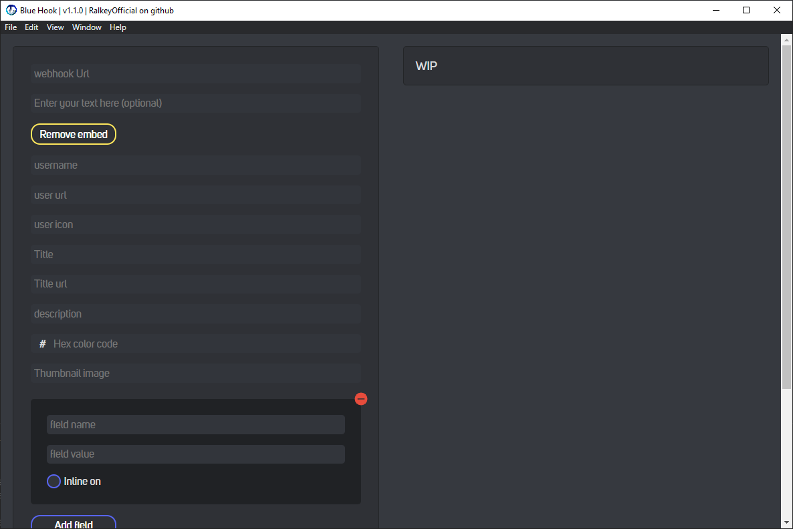

# 
Discord Blue Hook

 

    

 

Blue Hook is an open source project dedicated to being able to send webhook's to discord's webhook service with an easy to use GUI

---

## What is a webhook?

a webhook is a custom URL which acts as a gateway between any kind of service (script, website, etc) and discord channels.

by sending data to the custom URL we can get discord to display a message in a discord channel.

[read more about webhooks here.](https://support.discord.com/hc/en-us/articles/228383668-Intro-to-Webhooks)

by using Blue Hook's easy to use GUI you are able to send highly customized messages to the channel.

---

## Preview:

---

## supported OS:

- Windows

## features:

- send normal text message or embed to custom webhook URL
- really customizable [embed](https://discordjs.guide/popular-topics/embeds.html)
  - custom author element
    - custom name
    - add URL to name (name required)
    - add icon
  - custom title element
    - custom title
    - add URL to title (title required)
  - custom description
  - custom embed color (HEX format)
  - custom thumbnail image URL
  - custom field element
    - custom field name (can be empty)
    - custom field value (can be empty)
    - field [inline](https://discordjs.guide/popular-topics/embeds.html#notes) toggle
    - add/remove multiple field elements
  - custom image URL
  - custom footer element
    - custom footer text
    - custom footer icon
    - toggle footer timestamp
