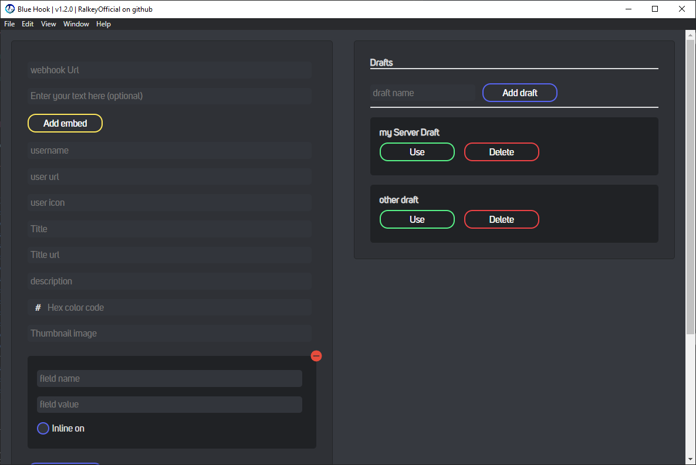

# 
Discord Blue Hook

    

Discord Blue Hook is an open source project dedicated to being able to send webhook's to discord's webhook service with an easy to use GUI

---

## Preview:

---

## features:

- send embed to custom webhook URL
- really customizable [embed](https://discordjs.guide/popular-topics/embeds.html)
  - custom author element
    - custom name
    - add URL to name (name required)
    - add icon
  - custom title element
    - custom title
    - add URL to title (title required)
  - custom description
  - custom embed color (HEX format)
  - custom thumbnail image URL
  - custom field element
    - custom field name (can be empty)
    - custom field value (can be empty)
    - field [inline](https://discordjs.guide/popular-topics/embeds.html#notes) toggle
    - add/remove multiple field elements
  - custom image URL
  - custom footer element
    - custom footer text
    - custom footer icon
    - toggle footer timestamp
